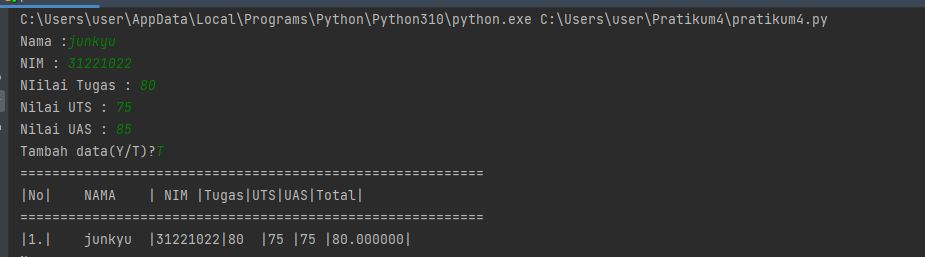

#Pratikum4
### TUGAS DAN LATIHAN PRATIKUM KE-4
### Latihan

## Membuat List sebanyak 5 Elemen
## Akses ListP:
```
print('#Akses List')
r = [8,6,4,9,2]
print(r)
print('- Elemen ke-3 : ', r[3])
print('-Nilai Elemen ke-2 Sampai Elemen ke-4 : ',r[2:5])
print('-Elemen Terakhir : ', r[-1])
```
tampikan elemen ke 3 lalu ambil nilai elemen ke 2 sampai elemmen ke 4 dan elemen terakhir


## Mengubah Elemen List
```
print('# Mengubah Elemen List')
a = ['Asahi', 'Yhosi', 6,18,21]
print(a)
a[1]='Haruto'
print('- mengubah data kedua : ', a)
a[4:5]=12,16
print('- Mengubah data ke-4 sampaidata Terakhir: ', a)
print(a)
```
Mengubah elemen ke 4 dengan nilai yang lain sampai dengan elemen terakhir


## Menambahkan Elemen List
```
print('# Menambahkan Elemen List')
n = ['Landak', 'Singa', 'Serigala', 'kupu-kupu', 'koala']
print(n)
A = n[0:2]
B = n[2:]
print(A)
print(B)
B.append('Harimau')
print('- Menambahkan list B Dengan Nlai String : ', B)
B.extend([3, 6, 8])
print('- Menambahkan List B Dengan 3 Nilai : ',B)
B.extend(A)
print('-Menggabungkan List B Dengan List A : ', B)
```
Mengammbil 2 bagian dari List pertama lalu jadikakn menjadi List ke dua. tambahkan list ke dua dengan 3 nilai lau gabungkan kedua list


### TUGAS
## Buat Perogamn Sederhana
Membuat progam sederhana untuk menambahkan data kedalam sebuah List dengan mengunakan perulangan. lalu tampilkan pertanyaan unuk menambahkan data contoh: (y/t). apa bila menjawab 't'(tidak)maka data otomatis akan ditampilkan. dan masukan Nilai akhir, nilai di ambil dari perhitungan 3 konseponen nilai (Tugas 30%, UTS 35%, UAS 35%).

```
while True:
    Nama=input('Nama :')
    NAMA.append(Nama)
    nim=int(input('NIM : '))
    NIM.append(nim)
    nTugas = float(input('NIilai Tugas : '))
    Tugas.append(nTugas)
    uts=float(input('Nilai UTS : '))
    UTS.append(uts)
    uas=float(input('Nilai UAS : '))
    UAS.append(uts)
    nAkhir=(int(nTugas)*.3)+(int(uts)*.35)+(int(uas)*.35)
    Total.append(nAkhir)

    lagi=''
    while lagi !='Y'and lagi !='T':
        lagi = input('Tambah data(Y/T)?')
        if lagi == 'T':
             print ('='*58)
             print('|No|\tNAMA\t| NIM |Tugas|UTS|UAS|Total|')
             print('='*58)
        for i in range(len(NIM)):
            mn='|%d.|\t%s\t' % (i+1, NAMA[i])
            im='|%d' % NIM[i]
            tg='|%d' % Tugas[i]
            ut='  |%d' % UTS[i]
            us=' |%d' % UAS[i]
            ak=' |%2f' % Total[i]
            ov='|'
            join =mn+im+tg+ut+us+ak+ov
            print(join)

            break

```


